<div align="center">

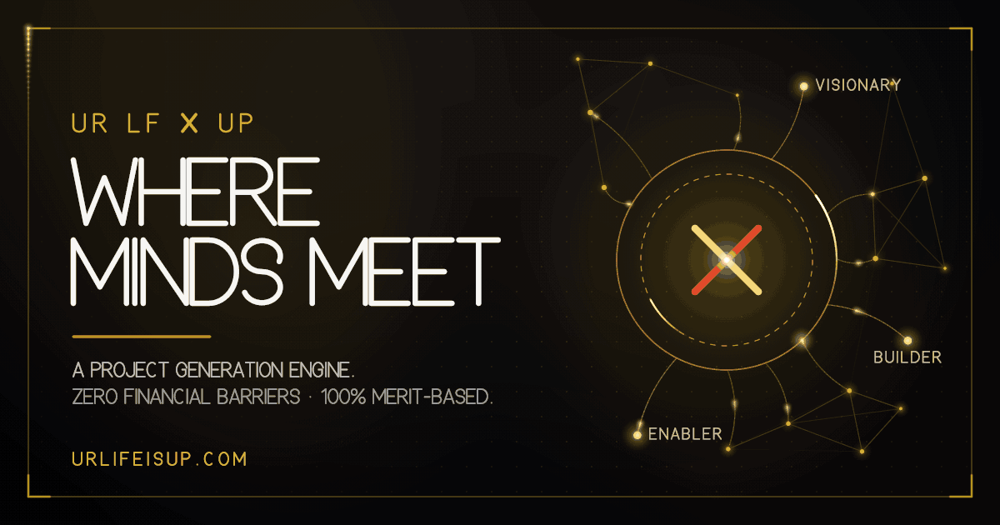

<h1>UrLife — Where Minds Meet</h1>

<p>
  <strong>A project generation engine for the Arab world.</strong><br>
  Visionaries bring ideas. Builders bring skill. Enablers bring capital.<br>
  An AI pre-brief and one 45-minute closed meeting decide what gets built.
</p>

<p>
  
  
  
  
  
  
</p>

<p>
  <a href="#1--system-architecture"><b>System Architecture</b></a> ·
  <a href="#2--feature-matrix"><b>Feature Matrix</b></a> ·
  <a href="#3--core-workflows"><b>Core Workflows</b></a> ·
  <a href="#4--tech-stack"><b>Tech Stack</b></a> ·
  <a href="#7--quick-start">Quick start</a> ·
  <a href="#9--known-gaps">Known gaps</a>
</p>

</div>

---

## Abstract

UrLife is a single-page marketing site with a progressively-loaded member console
bolted to the same document. It is written in vanilla ES2022 modules with **no UI
framework**, **two runtime dependencies**, and **no server-side code of any kind** —
the browser talks to Postgres through Supabase directly, and row-level security is
the entire authorisation model.

This document is the engineering specification. Every number in it is produced by a
command in this repository, and every architectural rule it states is enforced by a
test, a lint rule or a build plugin rather than by convention. Where something is
unverified it is listed in [§9 Known gaps](#9--known-gaps) instead of being rounded
up into a claim.

| Dimension                          |                                            Measured | Enforced at                                        |
| :--------------------------------- | --------------------------------------------------: | :------------------------------------------------- |
| Critical path, gzip                |                      **53.9 kB** across **3 files** | build fails above 24 kB HTML / 170 kB total        |
| Reduction vs. pre-upgrade baseline |                    **−58.1 %** (128.7 kB → 53.9 kB) | `measure:baseline` exits 1 on regression           |
| Automated specs                    |                             **252** across 14 files | CI, every push                                     |
| Accessibility                      |      **0** axe-core violations in **5** page states | CI, every push                                     |
| Runtime dependencies               |  **2** (`@supabase/supabase-js`, `@capacitor/core`) | contract test proves each is imported              |
| Simulation cost                    | **0.0134 ms/frame** @ 80 particles (legacy: 0.0394) | `npm run bench`                                    |
| Rendezvous layer overhead          |                    **~0 %** at max cadence (see §5) | `npm run bench`                                    |
| First-paint backend bytes          |                                               **0** | `vendor-supabase` is unreachable from `index.html` |

> [!IMPORTANT]
> **The Open Graph card was broken and is now the highest-fidelity asset in the repo.**
> `og:image` pointed at an SVG, which no major unfurler renders — every share of this
> site produced a blank card. It is now
> [`public/og-image-animated.gif`](public/og-image-animated.gif): a 1200×630 animated
> GIF generated from code with zero dependencies, whose first frame is a complete
> poster. See [§3.8 Brand asset pipeline](#38-brand-asset-pipeline--the-open-graph-card).

---

## Contents

1. [System Architecture](#1--system-architecture)
2. [Feature Matrix](#2--feature-matrix)
3. [Core Workflows](#3--core-workflows)
4. [Tech Stack](#4--tech-stack)
5. [Performance envelope](#5--performance-envelope)
6. [Quality gates](#6--quality-gates)
7. [Quick start](#7--quick-start)
8. [Repository map](#8--repository-map)
9. [Known gaps](#9--known-gaps)
10. [Security, licence, provenance](#10--security-licence-provenance)

---

# 1 · System Architecture

## 1.1 Execution model

One document. One module entry. One ordered boot sequence. Everything that touches the
network is behind a dynamic `import()` and is therefore absent from first paint.

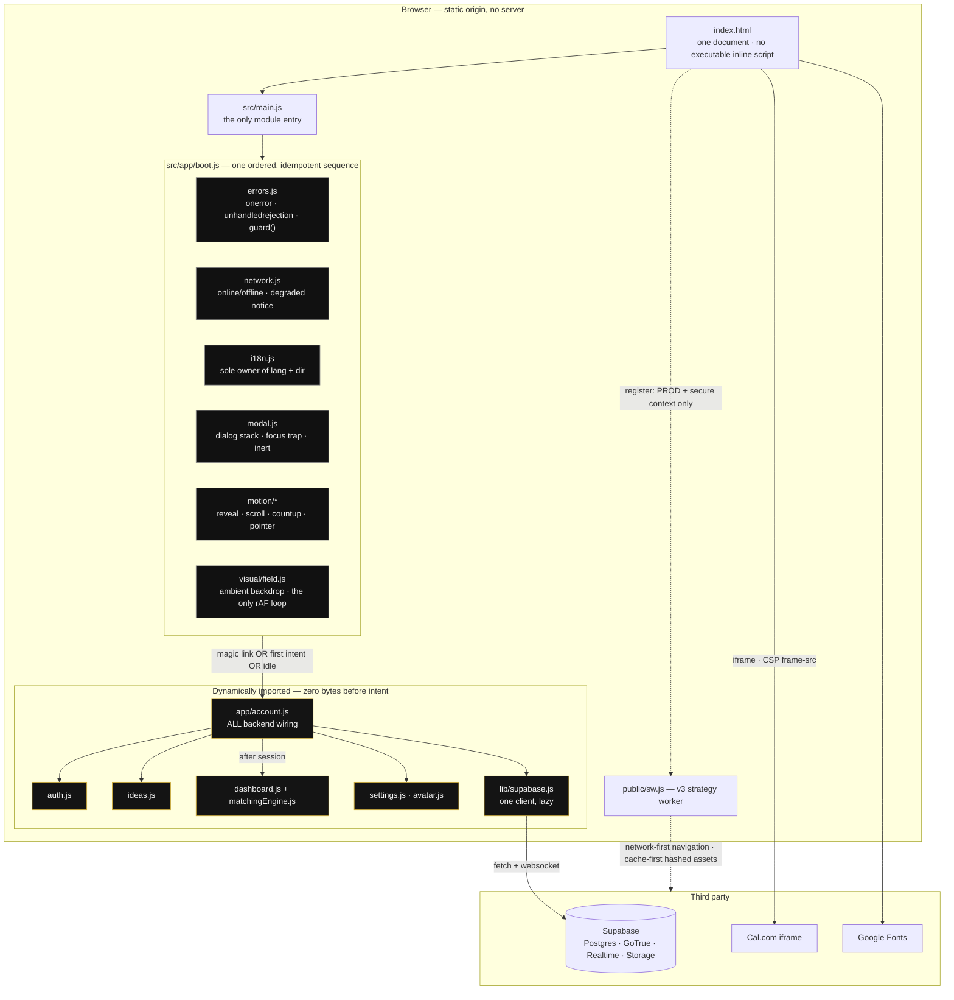

**Why this shape.** The previous document loaded _eight_ competing module entry points,
each with its own `DOMContentLoaded` guard. The result was four `IntersectionObserver`s,
three language switchers, two tilt handlers and two Supabase clients racing each other —
papered over at runtime by a `purgeDuplicates()` + `MutationObserver` hack. Module
execution order across eight independent entries is not guaranteed by the platform, so
the bug was not fixable by ordering `<script>` tags. It was fixable only by having one
entry and one explicit sequence, which is what `boot.js` is.

Each step is wrapped in `guard()`: a throw inside the field renderer disables the field
and nothing else. Boot is idempotent — a second call returns the first result rather than
stacking document listeners — which is what makes HMR and the test suite safe.

## 1.2 The critical-path contract

> **Critical path** = `index.html` plus every asset it references with `src`/`href`.
> Code reachable only through a dynamic `import()` is excluded, because the browser does
> not block first paint on it.

| Asset               |        gzip | Why it is here                                                |
| :------------------ | ----------: | :------------------------------------------------------------ |
| `index.html`        |     23.1 kB | the document, with all markup and no executable inline script |
| `assets/main-*.js`  |     17.0 kB | boot, i18n, modals, motion, the field                         |
| `assets/main-*.css` |     13.9 kB | the design system                                             |
| **Total**           | **53.9 kB** | **3 requests**                                                |

The 51.1 kB Supabase client sits in `vendor-supabase`, which `index.html` never
references. It is fetched on a magic-link callback, on the first sign of CTA intent, or
at idle — whichever happens first. Shipping it eagerly is the single largest regression
available in this codebase, so the build measures it on every run.

## 1.3 Module ownership

Single ownership is the invariant that keeps the above from decaying. Each rule below is
machine-enforced; none of them is a style preference.

| Rule                                               | Enforced by                                           | Failure mode               |
| :------------------------------------------------- | :---------------------------------------------------- | :------------------------- |
| Exactly one module entry point                     | contract test                                         | test fails                 |
| No executable inline `<script>`                    | contract test + CSP without `unsafe-inline`           | test fails, browser blocks |
| No authored inline `<style>` over 2 kB             | `noInlineStyleBlocks` Vite plugin                     | **build fails**            |
| Critical path ≤ 24 kB gz HTML, ≤ 170 kB gz total   | `sizeBudget` Vite plugin                              | **build fails**            |
| Critical path never exceeds the recorded baseline  | `measure:baseline` in CI                              | **exit 1**                 |
| Exactly one Supabase client                        | global-keyed singleton + ESLint import ban            | lint fails                 |
| Exactly one owner of `lang` / `dir`                | `i18n.js` + flow test                                 | test fails                 |
| No element observed by two `IntersectionObserver`s | boot flow test maps node → watchers                   | test fails                 |
| `console.*` only inside `logger.js`                | ESLint `no-console`                                   | lint fails                 |
| No non-literal `innerHTML`                         | ESLint `no-restricted-syntax` (one audited exemption) | lint fails                 |
| Nothing imports `archive/`                         | ESLint `no-restricted-imports`                        | lint fails                 |
| Every runtime dependency is actually imported      | contract test                                         | test fails                 |
| Zero axe-core violations                           | a11y suite in CI                                      | test fails                 |
| `og:image` is never SVG and always exists on disk  | contract test                                         | test fails                 |

## 1.4 Data plane

There is no application server. The browser holds a `VITE_`-prefixed anon key — **public
by construction** — and Postgres row-level security is the whole of the authorisation
model. `nexus-schema.sql` is the source of truth: **3 tables, 3 enums, 4 views,
17 indexes, 11 policies, 8 triggers**, with RLS both `ENABLE`d and `FORCE`d on all three
tables.

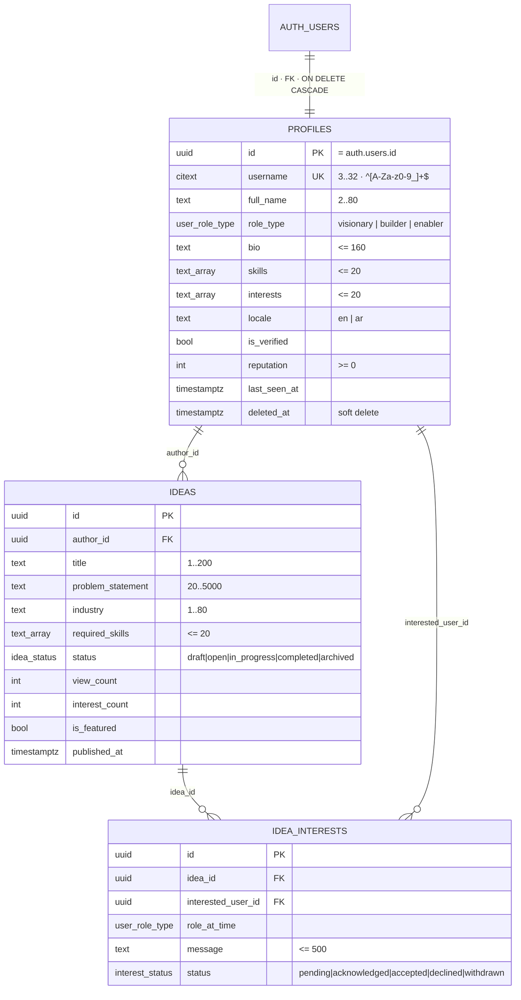

`src/validators.js` exports `ROLE_TYPES` as the single client-side mirror of the
`user_role_type` enum, and a unit test asserts nothing outside it is ever accepted.

> [!NOTE]
> The member console now speaks the committed schema directly: idea writes use
> `author_id` + `problem_statement`, discovery reads `ideas_public`, and the match workflow
> is built on `idea_interests` instead of the removed `matches` / `v_top_matches`
> prototype. The dashboard computes explainable scores client-side from profiles, skills,
> interests and idea requirements, then persists only the durable hand-raise state.

## 1.5 Render fallback ladder

The ambient field is the only continuous `requestAnimationFrame` loop in the system. It
negotiates downward and never blocks a paint. On every tier that runs at all, it performs
the same story: particles drift in a depth-graded gold haze, links wake where the pointer
rests, the camera dollies as the reader scrolls, and every few seconds two particles
rendezvous — they ease together, touch, flare warm ember, and stamp a soft expanding
ripple: _where minds meet_, staged rather than stated.

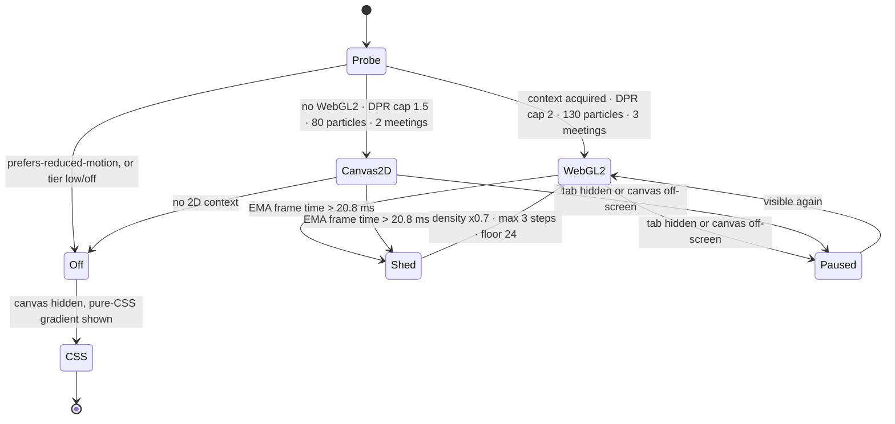

Device tier is derived from `deviceMemory`, `hardwareConcurrency`, Save-Data and
effective connection type. The governor is an exponential moving average of measured
frame cost, not a frame counter, so one slow frame does not trigger a downgrade and a
sustained regression always does.

## 1.6 Trust boundary

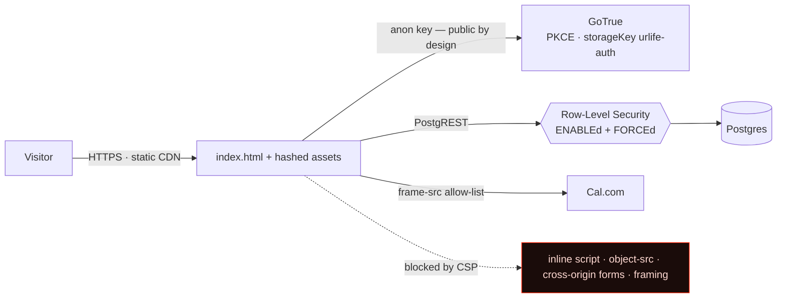

| Control       | Implementation                                                                                                                                                                                |
| :------------ | :-------------------------------------------------------------------------------------------------------------------------------------------------------------------------------------------- |
| Authorisation | Postgres RLS, forced on all three tables. The client cannot bypass it.                                                                                                                        |
| CSP           | `script-src 'self'` plus exact JSON-LD hash (no `unsafe-inline`), `object-src 'none'`, `base-uri 'self'`, `form-action 'self'`, `frame-ancestors 'none'`, exactly one third-party `frame-src` |
| Error text    | Supabase messages are never shown verbatim; they are mapped to a fixed set                                                                                                                    |
| Logging       | `logger.js` redacts anything shaped like a JWT, a Supabase key or a bearer token, plus any value under a key matching `token\|key\|secret\|password\|authorization`                           |
| Translations  | allow-list sanitiser: only `<strong> <em> <b> <i> <br> <span> <small> <u>` with `class` from a 4-value allow-list survive; `on*` attributes and `<script>` never do                           |
| Degraded mode | in production, a missing-credential condition is logged, never rendered — a misconfigured deploy must not leak its configuration surface                                                      |

---

# 2 · Feature Matrix

**Legend** — ● shipped and spec-covered · ◐ shipped with a named limit · ○ client-side
simulation, no backend contract · ◌ not built

### 2.1 Public surface

| Capability                                                         | Where                                                  | State | Verified by                            |
| :----------------------------------------------------------------- | :----------------------------------------------------- | :---: | :------------------------------------- |
| Single-page site: hero, process, roles, meeting, revenue, roadmap  | `index.html` (1,572 lines)                             |   ●   | `contracts/document.test.js`           |
| Bilingual EN ⇄ AR with full RTL inversion                          | `src/app/i18n.js` · 161 bilingual nodes                |   ●   | 14 flow specs + axe in both directions |
| Ambient constellation field (rendezvous · parallax · wake)         | `src/visual/{field,sim,renderer-webgl,renderer-2d}.js` |   ●   | 39 unit specs + `npm run bench`        |
| Reveal · scroll progress · count-up · pointer parallax             | `src/motion/*`                                         |   ●   | 25 boot/motion specs                   |
| Dialog stack: focus trap, `inert`, ESC, focus restore, scroll lock | `src/app/modal.js`                                     |   ●   | 15 modal specs                         |
| Cal.com booking embed                                              | `#cal-modal`                                           |   ●   | CSP `frame-src` allow-list asserted    |
| Custom cursor                                                      | `src/cursor.js`                                        |   ◐   | fine pointer + motion-allowed only     |
| Skip link, landmarks, `prefers-reduced-motion`                     | document + CSS + JS                                    |   ●   | a11y suite, 5 page states              |
| Works with JavaScript disabled                                     | `html.no-js` + opt-in reveals                          |   ◐   | content renders; console unavailable   |

### 2.2 Member console — every module lazily imported

| Capability                                | Where                                               | State | Note                                                                                        |
| :---------------------------------------- | :-------------------------------------------------- | :---: | :------------------------------------------------------------------------------------------ |
| Email + password sign-in / registration   | `src/auth.js`                                       |   ●   | validation runs **before** any network call                                                 |
| Magic link                                | `boot.js` → `account.js`                            |   ●   | loaded eagerly; the token must be consumed before expiry                                    |
| PKCE session, `storageKey: 'urlife-auth'` | `src/lib/supabase.js`                               |   ●   | one client, global-keyed singleton                                                          |
| Role selection against the Postgres enum  | `src/validators.js`                                 |   ●   | anything outside the enum is rejected                                                       |
| Idea submission with field-level errors   | `src/ideas.js`                                      |   ●   | schema-aligned `author_id` + `problem_statement`, auto-publishes open ideas                 |
| Ideas feed                                | `#ideas-feed-list`                                  |   ●   | every field written via `textContent`; accepts current and legacy problem aliases           |
| Nexus recommendations dashboard           | `src/dashboard.js`                                  |   ●   | reads `ideas_public` + `idea_interests`; no absent match table dependency                   |
| Explainable match scoring                 | `src/matchingEngine.js`                             |   ●   | role, fuzzy skills, industry, capital, reputation and data-confidence axes                  |
| Realtime interest / idea updates          | `supabase.channel('nexus')`                         |   ◐   | `postgres_changes`; untested against a live project                                         |
| Deal room + escrow state machine          | `src/components/DealRoom.js`, `src/escrowEngine.js` |   ○   | `Pending → Locked → Verified → Released`, **in-browser only — no custody, no payment rail** |
| Verification badge tiers                  | `src/components/VerificationBadge.js`               |   ○   | presentational; no issuing authority                                                        |
| Settings + avatar upload                  | `src/settings.js`, `src/avatar.js`                  |   ●   | Supabase Storage                                                                            |

### 2.3 Platform and delivery

| Capability                                            | Where                                          | State | Note                                                                                                  |
| :---------------------------------------------------- | :--------------------------------------------- | :---: | :---------------------------------------------------------------------------------------------------- |
| PWA manifest + 11 generated icon assets               | `public/manifest.webmanifest`, `public/icons/` |   ●   | 135.7 kB, rasterised from SDF code                                                                    |
| Service worker v3                                     | `public/sw.js`                                 |   ●   | network-first navigation (4 s timeout) · cache-first hashed assets · SWR for the rest · 120-entry cap |
| Offline fallback document                             | `sw.js` → `OFFLINE_HTML`                       |   ●   | inline, dependency-free                                                                               |
| **Animated Open Graph card**                          | `public/og-image-animated.gif`                 |   ●   | 1200×630 · 72 frames · 3.6 s loop · 879 kB — [§3.8](#38-brand-asset-pipeline--the-open-graph-card)    |
| True-colour OG still                                  | `public/og-cover.png`                          |   ●   | identical frame, 275 kB, for clients preferring a raster still                                        |
| SEO: canonical, hreflang ×3, sitemap, robots, JSON-LD | document + `public/`                           |   ●   | contract-tested                                                                                       |
| Native shells                                         | `android/`, `ios/`, Capacitor 7                |   ◐   | not exercised in CI — needs Xcode / Android SDK                                                       |
| Degraded mode with no credentials                     | `src/lib/supabase.js` stub                     |   ●   | site renders, scrolls, animates; writes resolve `BackendUnavailableError`                             |

### 2.4 Engineering surface

| Capability                             | Mechanism                                                | State |
| :------------------------------------- | :------------------------------------------------------- | :---: |
| Size budget as a build failure         | `sizeBudget` Vite plugin                                 |   ●   |
| Inline-CSS regression guard            | `noInlineStyleBlocks` Vite plugin                        |   ●   |
| Falsifiable before/after               | `.baseline/dist/` committed + `measure:baseline`         |   ●   |
| Dependency hygiene                     | contract test greps `src/` for every declared dependency |   ●   |
| Accessibility in CI                    | axe-core over the real document in 5 states              |   ●   |
| Deterministic brand assets from source | `npm run brand`                                          |   ●   |
| Renderer benchmark                     | `npm run bench` — 9 × 600 frames, median + min           |   ●   |

---

# 3 · Core Workflows

## 3.1 Cold start

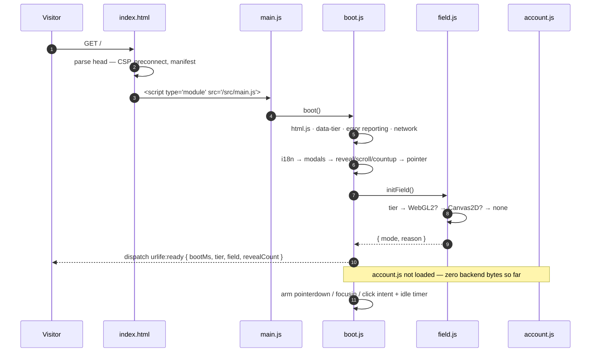

`?debug=1` mounts a live stats overlay on top of this; it is never present otherwise.

## 3.2 Intent capture — the click-replay race

The lazy-loading win is only real if it never costs a click. A visitor can press a CTA
10 ms after `pointerdown`, while `account.js` is still in flight and no real handler
exists yet. A capture-phase listener holds the event and replays it.

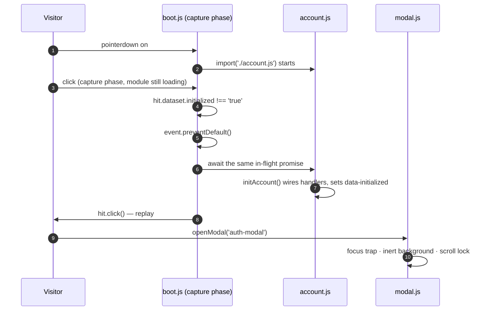

Three triggers race to load the module and the first one wins: a magic-link callback
(`#access_token`, `?code=`, `?token_hash=`, `?type=magiclink`) loads it **eagerly**,
otherwise the first `pointerdown`/`focusin` on any CTA, otherwise `requestIdleCallback`
with a `setTimeout` fallback for Safari.

## 3.3 Authentication

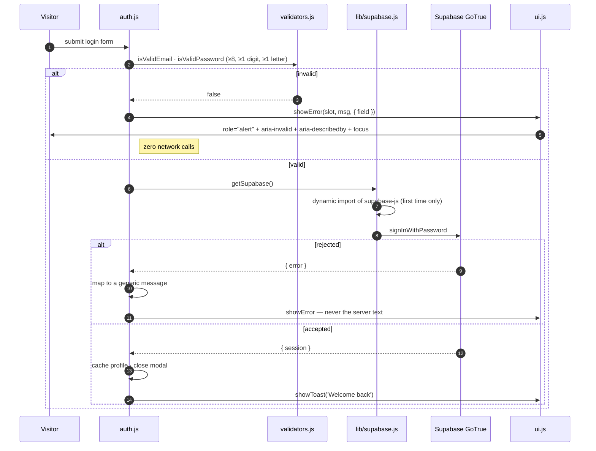

`Invalid login credentials: user 4b21 not found` surfaces to the user as
_"Incorrect email or password."_ — asserted by spec, because the raw string is a user
enumeration oracle.

## 3.4 Idea submission

| Field    | Client rule  | Behaviour on failure                                          |
| :------- | :----------- | :------------------------------------------------------------ |
| Title    | 5–200 chars  | `role="alert"` slot, `aria-invalid`, focus moved to the field |
| Industry | 2–80 chars   | same                                                          |
| Problem  | ≥ 20 chars   | same                                                          |
| Skills   | ≤ 20 entries | chip input refuses the 21st                                   |

A visitor whose role is not _Visionary_ is **not** silently rejected: the draft is written
to `sessionStorage['nexus_pending_idea']` and a toast offers _"Switch to Visionary"_. On
success the row is inserted and the card is rendered into `#ideas-feed-list` with every
field written through `textContent` — user content is never parsed as markup.

## 3.5 Match and deal room

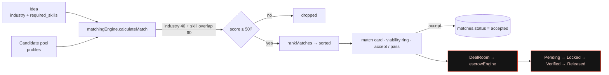

> [!NOTE]
> The red path is a **client-side simulation**. `escrowEngine.js` is a state machine with
> validated transitions and an audit trail in memory — there is no custody, no payment
> rail and no counterparty verification behind it. It is honest scaffolding for the
> interaction design, and it is labelled as such here so nobody mistakes it for a
> financial control.

## 3.6 Language switch

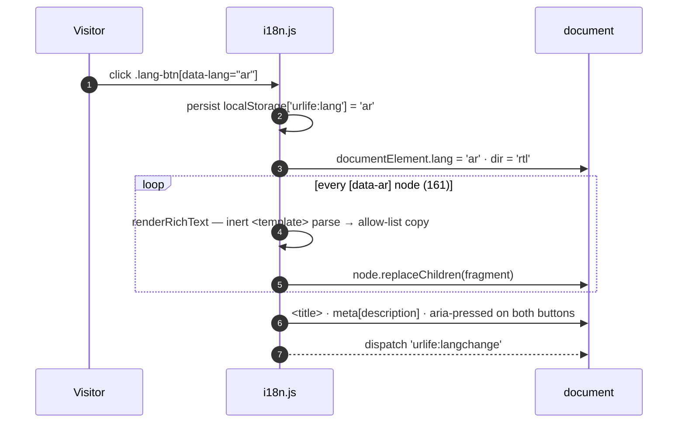

`lang` and `dir` have exactly one owner and always change together — a flow test asserts
it, because a half-applied switch is how RTL layouts break in production. `?lang=`
overrides the stored value.

## 3.7 Degraded mode and offline

| Condition                                                 | Behaviour                                                                                                                                                                                                                                                                 | Spec             |
| :-------------------------------------------------------- | :------------------------------------------------------------------------------------------------------------------------------------------------------------------------------------------------------------------------------------------------------------------------ | :--------------- |
| No Supabase credentials                                   | Everything renders, scrolls and animates. `getSupabaseSync()` returns a chainable stub: reads resolve empty, writes resolve `{ error: BackendUnavailableError }`. The stub is never memoised into the real singleton slot, so a real client can still be installed later. | `ui-and-network` |
| …in development                                           | A banner names the missing variables — never their values.                                                                                                                                                                                                                | `ui-and-network` |
| …in production                                            | The same condition is logged and never rendered.                                                                                                                                                                                                                          | `ui-and-network` |
| Offline navigation                                        | Network-first with a 4 s timeout → cached shell → inline offline document.                                                                                                                                                                                                | `sw.js`          |
| Hashed asset                                              | Cache-first; immutable by construction.                                                                                                                                                                                                                                   | `sw.js`          |
| Supabase `/rest/`, `/auth/`, non-GET, cross-origin, range | Never touched by the worker.                                                                                                                                                                                                                                              | `sw.js`          |

## 3.8 Brand asset pipeline — the Open Graph card

### The defect

`og:image` pointed at `public/og-cover.svg`. **SVG is not a valid Open Graph image for any
unfurler that matters.** Facebook, LinkedIn, WhatsApp, Slack, Discord, Telegram and X all
either reject it or render nothing. The most-shared, least-controlled surface the product
has — a link in a WhatsApp group or a DM to an investor — was unfurling as a bare blue
link with no card at all.

| Client                         | SVG `og:image` | GIF `og:image`                   |
| :----------------------------- | :------------- | :------------------------------- |
| Facebook · LinkedIn · WhatsApp | not rendered   | rendered, **static first frame** |
| X (Twitter)                    | not rendered   | rendered                         |
| Slack · Discord · Telegram     | not rendered   | rendered, **animated**           |
| GitHub README                  | n/a            | animated                         |

Because half of those clients show frame 0 and nothing else, **frame 0 is a complete,
finished poster.** The animation is an enhancement; the composition never depends on it.

### The replacement

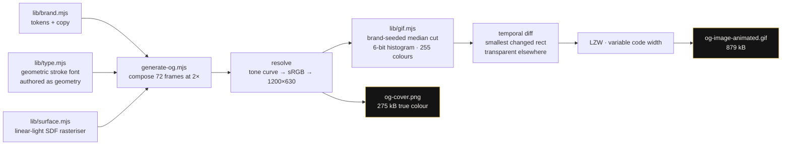

Seven techniques do the work, and each one is load-bearing:

|   # | Technique                                                    | Why it is there                                                                                                                                                                                                                                                                  |
| --: | :----------------------------------------------------------- | :------------------------------------------------------------------------------------------------------------------------------------------------------------------------------------------------------------------------------------------------------------------------------- |
|   1 | **Linear-light compositing**, encoded to sRGB exactly once   | Additive glow in gamma space darkens midtones and turns overlapping highlights grey. This is the single most common reason procedurally-generated "premium" art looks cheap.                                                                                                     |
|   2 | **SDF anti-aliasing** instead of per-primitive supersampling | A 1.1 px hairline stays 1.1 px at any scale, in one pass.                                                                                                                                                                                                                        |
|   3 | **2× supersample** with a filmic shoulder (C¹ at the knee)   | Hot specular cores roll off to white instead of clipping into flat discs.                                                                                                                                                                                                        |
|   4 | **A geometric monoline face authored as stroke geometry**    | No TTF to vendor, no licence to honour, no network at build time, and the brand `✘` is a real glyph rather than a font fallback. ~40 glyphs, diffable, scalable.                                                                                                                 |
|   5 | **Brand-seeded median cut over a 6-bit histogram**           | The usual 5-bit histogram is _wrong_ for an obsidian card: 90 % of pixels live between sRGB 5 and 30, four bins wide at 5 bits, so the backdrop contours into visible rings. At 6 bits it resolves. Exact brand colours are pinned so `#D4AF37` survives quantisation as itself. |
|   6 | **Ordered (Bayer) dithering, never error diffusion**         | Floyd–Steinberg propagates error along the row, so one moving spark changes every pixel downstream of it and the temporal diff explodes. An ordered pattern is identical frame to frame, so unchanged pixels stay byte-identical.                                                |
|   7 | **Temporal diff with transparency + disposal 1**             | Each frame encodes only the smallest rectangle that changed; everything else is the transparent index.                                                                                                                                                                           |

### Measured result

| Metric                                     |                                                                     Value |
| :----------------------------------------- | ------------------------------------------------------------------------: |
| Canvas                                     |        1200 × 630 (the 1.91 : 1 contract every unfurler lays out against) |
| Frames · loop                              | 72 · 3.6 s at 5 cs/frame (above the 4 cs floor browsers silently rewrite) |
| Palette                                    |                                         255 colours + 1 transparent index |
| Frame 0 payload (a full 756,000 px poster) |                                                                  136.8 kB |
| Frames 1–71 payload                        |                                **10.4 kB mean** (6.6 kB min, 20.3 kB max) |
| Pixels whose value actually changes        |                                            **2.8 %** of the loop's 54.4 M |
| Naive full-frame encode of the same 72     |                                                                   9.62 MB |
| **Shipped**                                |           **879 kB — 11.2× smaller**, well inside every crawler's ceiling |
| Still poster                               |                            `og-cover.png`, 275 kB, true colour, identical |
| Determinism                                |        byte-identical across runs (`md5` verified); seeded PRNG, no clock |
| Dependencies used to produce it            |                                                                     **0** |

### The optical model

The card is lit, not drawn. Five rules produce that, and every one of them is a line of
code rather than an asset:

|   # | Rule                                                                                                    | What it buys                                                                                                                                                                                                      |
| --: | :------------------------------------------------------------------------------------------------------ | :---------------------------------------------------------------------------------------------------------------------------------------------------------------------------------------------------------------- |
|   1 | Composite in **linear light**, encode to sRGB exactly once                                              | Additive glow in gamma space darkens midtones and turns overlapping highlights grey. This single rule is the most common reason procedural "premium" art looks cheap.                                             |
|   2 | **Bloom** the static layer: extract the overshoot above a threshold, blur it, add it back               | Light bleeds into its surroundings. Without it, type and geometry sit _on_ the card instead of _in_ it. Three box passes approximate a Gaussian to within ~3 % at O(1) per pixel.                                 |
|   3 | One **key light at 132°**, and every circular element obeys it                                          | The rim, the bevel inside it, the graduated dial and the dashed track are all stroked with brightness tracking that angle. A ring at constant alpha is an outline; a ring that tracks a light is a machined edge. |
|   4 | **Atmospheric depth** — 30 dim bokeh discs and 20 volumetric shafts, all clamped out of the type column | Gives the constellation something to sit in front of. Light behind letterforms costs contrast, and contrast is the only thing that keeps the card legible at 240 px wide in a Slack sidebar.                      |
|   5 | A **vertical gradient on the headline**, near-white at the cap line to warm bone at the baseline        | The eye reads the gradient as a light source above the card. It is the difference between type that is lit and type that is filled.                                                                               |

### What a diff-encoded GIF actually charges for

This is the part that is easy to get wrong, and the measurements are blunt about it.

A GIF frame is **one rectangle**. Pixels that did not change are written as the
transparent index — cheap, but still written. So the price of a frame is set by the
_bounding box of everything that moved_, not by how much of it moved:

| Quantity                                             |       Value |
| :--------------------------------------------------- | ----------: |
| Pixels whose value actually changes, per frame       |     ~10,800 |
| Pixels inside the re-encoded rectangle, per frame    | **336,000** |
| Overhead imposed purely by the single-box constraint |     **31×** |

Which means the lever is **choreography, not detail**. Three decisions, each measured
by rebuilding the whole card and weighing the file:

| Decision                                                                                       |   Before |    After |           Δ |
| :--------------------------------------------------------------------------------------------- | -------: | -------: | ----------: |
| A point of light orbiting the full perimeter every frame → **two runners locked to the sheen** | 1,226 kB | 1,076 kB | **−150 kB** |
| Three continuously expanding shock rings → **one, duty-cycled, contained by the rim**          | 1,076 kB |   872 kB | **−204 kB** |
| Adding a per-frame bloom pass over the dial                                                    | 1,000 kB |   872 kB | **−128 kB** |

The first two are intuitive once you know the rule: a lit pixel on the left edge and a
lit pixel on the right edge force all 71 deltas to span the entire 1200 px, so the
headline and the dial get re-encoded seventy-one times to animate a dot. Tying the
runners to the specular sweep collapsed the mean rectangle from 876 × 523 to
651 × 508 — and it reads better, because the card now performs one scanning gesture and
then rests, instead of fidgeting.

The third is not intuitive at all: **adding** a blur made the file _smaller_. Bloom
smooths the hub, ordered dithering has less gradient to break up, and LZW finds far
longer runs. Optical quality and compression pointed the same way, which does not
happen often enough to assume.

> [!NOTE]
> **Film grain was prototyped and rejected.** It looked good and it was never going to
> pay for itself: on an 8-frame probe it took the GIF from 329 kB to 547 kB and the PNG
> poster from 282 kB to **1,194 kB**, to supply texture the ordered dither already
> supplies. It is not in the tree — `Surface#grain` was deleted rather than left
> unused.

### Reproducing and art-directing it

```bash
npm run og                                   # regenerate both assets
npm run og -- --frames=96 --delay=4          # smoother, longer loop
npm run og -- --poster=20 --out=/tmp/look    # art-direct: render elsewhere, pick a frame
npm run brand                                # icons + favicon + OG, all of it
```

Composition: `UR LF ✘ UP` eyebrow, a two-line display headline carrying a specular sweep,
the positioning line, the domain — and on the right, **VISIONARY**, **BUILDER** and
**ENABLER** wired by filaments into the mark at the centre of a graduated dial, with light
packets travelling inward and flaring the core on arrival. One idea, stated four ways:
_minds converging_. The loop is 3.6 s, seamless, and everything that does not carry that
idea is still — which is simultaneously the design decision and the compression strategy.
---

# 4 · Tech Stack

| Layer         | Choice                                         | Version     | Why this and not the obvious alternative                                                                                                   |
| :------------ | :--------------------------------------------- | :---------- | :----------------------------------------------------------------------------------------------------------------------------------------- |
| Language      | ES2022 modules                                 | —           | The app graph is plain JS. TypeScript is installed for editor-level checking only; no transpile step guards the runtime.                   |
| UI            | Hand-written DOM                               | —           | The entire interactive surface is ~10 dialogs, a feed and a dashboard. A framework would have cost more gzip than the whole critical path. |
| Build         | Vite                                           | 6           | `appType: 'mpa'`, single HTML input, manual vendor chunking, two custom plugins that fail the build on regression.                         |
| Styling       | Plain CSS + custom properties                  | —           | No preprocessor, no Tailwind build. Tailwind-looking class _names_ appear in the markup and are inert — they are legacy, not a dependency. |
| Backend       | Supabase — Postgres, GoTrue, Realtime, Storage | `^2.105`    | Browser-direct. No application server exists, so there is no server to compromise, deploy or pay for.                                      |
| Auth          | Email + password and magic link, PKCE          | —           | `storageKey: 'urlife-auth'`, one client, lazily imported.                                                                                  |
| Authorisation | Postgres RLS, `ENABLE` + `FORCE`               | —           | The anon key is public by construction; RLS is the only real boundary.                                                                     |
| Scheduling    | Cal.com iframe                                 | —           | The single allowed third-party frame origin.                                                                                               |
| Visual layer  | Dependency-free WebGL2, written in-repo        | —           | Replaced `three` + `@react-three/*` + `gsap` + `lenis` (~600 kB) that **nothing imported**. 2 draw calls.                                  |
| Native shells | Capacitor                                      | 7           | `android/`, `ios/`, `capacitor.config.ts`.                                                                                                 |
| Tests         | Vitest + jsdom + axe-core                      | `^3.2`      | 252 specs: unit, flow, contract, accessibility.                                                                                            |
| Lint / format | ESLint flat config + Prettier                  | `^9` / `^3` | Rules target the defect classes this codebase actually suffered, not style.                                                                |
| Hosting       | Any static CDN                                 | —           | No server-side code of any kind.                                                                                                           |
| Node          | ≥ 20.19                                        | —           | `engines` enforced.                                                                                                                        |

### Dependency budget

```
dependencies      2   @supabase/supabase-js   51.1 kB gz, off the critical path
                      @capacitor/core          native shells only
devDependencies  15   build · test · lint · format · coverage · native CLI
runtime bytes before first interaction                              0 kB
```

<details>
<summary><b>Removed during the upgrade, with evidence</b></summary>

`react`, `react-dom`, `@react-three/fiber`, `@react-three/drei`, `three`, `gsap`,
`lenis`. None was imported by any module reachable from the entry point — they were
downloaded by every visitor and executed by none. A contract test
(`tests/contracts/document.test.js` → _dependency hygiene_) now fails the build if any
declared runtime dependency is never imported, so the class of defect cannot return.

Also removed: a placeholder-CDN PWA icon (`via.placeholder.com`, offline-fatal and the
wrong brand gold), three inline `<script>` blocks, a 4,209-line inline `<style>`, a
hard-coded `/@vite/client` tag that 404s outside Vite, a duplicate Supabase client, and
the cache-first service worker that could permanently strand a visitor on a stale
`index.html` referencing deleted chunk hashes.

</details>

---

# 5 · Performance envelope

All figures are reproducible: `npm run measure:baseline` and `npm run bench`.
**Baseline** is the verbatim pre-upgrade build, committed at `.baseline/dist/` so the
comparison stays falsifiable after the source changed.

### Payload

| Metric                | Baseline |         Now |           Δ |
| :-------------------- | -------: | ----------: | ----------: |
| Critical path, gzip   | 128.7 kB | **53.9 kB** | **−58.1 %** |
| Critical path, brotli | 108.1 kB |     45.6 kB |     −57.8 % |
| Critical path, raw    | 522.5 kB |    216.1 kB |     −58.6 % |
| Critical path, files  |        7 |       **3** |     −57.1 % |
| All assets, gzip      | 129.1 kB |    135.3 kB |      +4.8 % |

The "all assets" line moves a little: the 2026-10 field upgrade (rendezvous events,
scroll parallax, depth-graded rendering — §3) added ~2.6 kB gzip to the main chunk.
The same code still exists, it is simply no longer downloaded before first paint.

### Simulation and draw cost

Measured on the CI runner (node v22.22.3); medians swing between runs, minima do not.

| Case                                                    |    Median |           Min |                                    vs. legacy |
| :------------------------------------------------------ | --------: | ------------: | --------------------------------------------: |
| Legacy, 80 particles, O(n²) pair scan, r=180            | 0.0462 ms |     0.0394 ms |                                             — |
| Modern, 80 particles, spatial hash, identical params    | 0.0144 ms | **0.0126 ms** |                              **3.1× cheaper** |
| Modern, 130 particles, r=150 (shipping high tier)       | 0.0239 ms |     0.0232 ms | 1.7× cheaper **carrying 62 % more particles** |
| Modern, 130 particles + rendezvous at **max** cadence\* | 0.0235 ms |     0.0217 ms |  the story layer is free (−2 %, within noise) |

\* The bench schedules a new meeting every frame — deliberately worse than the
shipping cadence (one every 4–8 s) so the number bounds the feature, not flatters it.

| Canvas2D calls per frame, 80 particles |          Legacy |           Now | Why                                                                                           |
| :------------------------------------- | --------------: | ------------: | :-------------------------------------------------------------------------------------------- |
| `createRadialGradient`                 |              80 |         **0** | every particle allocated a gradient _per frame_; now one pre-rendered 64×64 sprite is blitted |
| `beginPath` / `stroke` / `strokeStyle` | 195 / 115 / 115 | **5 / 5 / 5** | links batched into 6 alpha bands                                                              |
| **Total state-changing calls**         |         **585** |        **90** | **−85 %**                                                                                     |

Removing 80 gradient allocations per frame also removes ~4,800 short-lived objects per
second from the GC's path — which is what actually produced the periodic hitches.

---

# 6 · Quality gates

Every push runs three jobs. None of them is advisory.

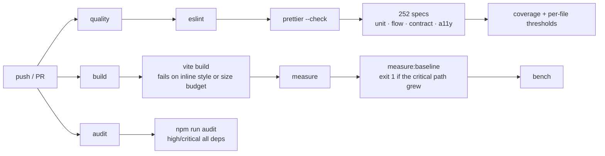

| Gate                         | Threshold                 | On breach                                           |
| :--------------------------- | :------------------------ | :-------------------------------------------------- |
| Inline `<style>`             | > 2 kB authored           | build fails (proven to fire on a 10,811-byte block) |
| HTML size                    | > 24 kB gzip              | build fails                                         |
| Total size                   | > 170 kB gzip             | build fails                                         |
| Critical path vs. baseline   | any growth                | CI exits 1                                          |
| axe-core                     | any violation in 5 states | tests fail                                          |
| Locked dependency advisories | high or critical          | audit job fails                                     |

---

# 7 · Quick start

```bash
npm ci
npm run dev        # http://localhost:5173 — bound to 0.0.0.0
```

No `.env` is required. With no Supabase credentials the site runs in **degraded mode**:
everything renders, scrolls and animates; only authenticated flows report that they are
unavailable, and a development-only banner names the missing variables.

```bash
cp .env.example .env.local    # then fill VITE_SUPABASE_URL and VITE_SUPABASE_ANON_KEY
```

<details>
<summary><b>Full command reference</b></summary>

| Command                                        | What it does                                                                            |
| :--------------------------------------------- | :-------------------------------------------------------------------------------------- |
| `npm run dev`                                  | Vite dev server, bound to `0.0.0.0`                                                     |
| `npm run build`                                | production build; **fails** on an inline `<style>` over 2 kB or a blown size budget     |
| `npm run preview`                              | serve `dist/`                                                                           |
| `npm test`                                     | 252 specs — unit, flow, contract, accessibility                                         |
| `npm run test:watch`                           | the same, in watch mode                                                                 |
| `npm run test:coverage`                        | coverage with enforced per-file thresholds                                              |
| `npm run lint` · `lint:fix`                    | ESLint flat config                                                                      |
| `npm run format` · `format:check`              | Prettier                                                                                |
| `npm run measure`                              | raw/gzip/brotli report for `dist/`, split by critical path                              |
| `npm run measure:baseline`                     | before/after vs. the committed pre-upgrade build; **exits 1 if the critical path grew** |
| `npm run bench`                                | field simulation + Canvas2D draw-call benchmark                                         |
| `npm run icons`                                | regenerate the 11 PWA / favicon assets from code                                        |
| `npm run og`                                   | regenerate `og-image-animated.gif` + `og-cover.png`                                     |
| `npm run brand`                                | icons + OG card, the complete identity set                                              |
| `npm run verify`                               | lint + test + build + measure + audit                                                   |
| `npm run cap:sync` · `cap:ios` · `cap:android` | Capacitor native shells                                                                 |

</details>

---

# 8 · Repository map

```
index.html                 the single document — no executable inline script, no large inline style
src/
  main.js                  the only module entry point
  app/
    boot.js                one ordered, idempotent startup sequence
    i18n.js                sole owner of lang/dir; allow-list sanitiser
    modal.js               dialog stack: focus trap, restore, inert, ESC, scroll lock
    account.js             ALL backend wiring — dynamically imported, never on first paint
    errors.js              global error reporting + per-step guard()
    network.js             online/offline, degraded-mode notice
    debug-overlay.js       ?debug=1 live field stats
  lib/
    env.js                 the single reader of import.meta.env
    supabase.js            the single Supabase client (lazy) + degraded-mode stub
    logger.js              level-aware structured logging with token redaction
  motion/                  prefs · reveal · scroll-fx · pointer-fx · countup
  visual/
    sim.js                 DOM-free particle simulation (Float32Array + spatial hash)
    renderer-webgl.js      dependency-free WebGL2, 2 draw calls
    renderer-2d.js         Canvas2D sprite-blit fallback
    field.js               backend selection, frame governor, lifecycle
  styles/                  legacy.css (frozen) + motion · components · a11y · index
  auth.js ideas.js dashboard.js settings.js …   feature modules, all lazy
scripts/
  generate-og.mjs          the animated Open Graph card
  generate-icons.mjs       PWA icons + favicon, from SDF code
  lib/
    brand.mjs              brand tokens + copy — one source of truth for every asset
    surface.mjs            linear-light SDF rasteriser + bloom + volumetric beams
    type.mjs               geometric monoline face, authored as stroke geometry
    gif.mjs                median-cut quantiser + temporal diff + LZW (GIF89a)
    png.mjs                minimal PNG encoder
  measure-bundle.mjs       size report + baseline comparison
  bench-field.mjs          simulation and draw-call benchmark
  render-preview.mjs       software raster of a sim frame (no GPU needed) — inspect the field's composition anywhere
public/                    icons · manifest · sw.js · og-image-animated.gif · og-cover.png
tests/                     unit · flows · contracts · a11y        (252 specs)
  unit/compositor.test.js  bloom energy conservation · blur edge clamping · beam clamps
docs/                      ARCHITECTURE.md · VERIFICATION.md · MIGRATIONS.md
archive/                   superseded code and documents, kept for provenance
.baseline/dist/            the verbatim pre-upgrade build, for falsifiable comparisons
```

---

# 9 · Known gaps

Listed rather than rounded off. Each one has the cheapest action that resolves it.

|   # | Gap                                                                    | Confidence                                    | Cheapest resolution                                                                                  |
| --: | :--------------------------------------------------------------------- | :-------------------------------------------- | :--------------------------------------------------------------------------------------------------- |
|   1 | Real-browser FPS, LCP and CLS                                          | Unknown — no browser in the build environment | `npm run preview` then `npx lighthouse http://localhost:4173 --preset=desktop`                       |
|   2 | Colour contrast, screen-reader announcement quality, RTL visual layout | Unknown — axe cannot see rendered pixels      | One manual pass with VoiceOver/NVDA and a contrast checker; steps in `docs/VERIFICATION.md` § Limits |
|   3 | Whether the Capacitor shells still compile                             | Unknown — needs Xcode / Android SDK           | `npm run cap:sync && npx cap open ios` on a Mac                                                      |
|   4 | Whether `VITE_CAL_LINK` is current                                     | **MEASURED DEAD 2026-10-02** — `cal.com/ahmed-urlfxup` is unclaimed, returns 404 | Register the cal.com username or set `VITE_CAL_LINK`; `npm run check:links` (CI job `link-liveness`) now fails until the booking link answers 200 |
|   5 | Production CSP violations                                              | Unknown                                       | Deploy with `Content-Security-Policy-Report-Only` + a report endpoint for 24 h                       |
|   6 | Escrow / deal room / verification tiers                                | **Simulation by design**                      | Treat as interaction scaffolding until a custody provider and an issuing authority exist             |

---

# 10 · Security, licence, provenance

- **Credentials.** Everything `VITE_`-prefixed is public by construction. Security rests
  on Postgres RLS, which `nexus-schema.sql` both `ENABLE`s and `FORCE`s on all three
  tables. There is no secret the browser could leak that it was not already holding.
- **CSP.** No arbitrary executable inline script, `object-src 'none'`, no framing, no cross-origin form posts,
  exactly one third-party frame origin.
- **Error text.** Supabase messages are never shown to users verbatim.
- **Logging.** The logger redacts JWT-shaped, key-shaped and bearer-shaped values and
  anything under a key matching `token|key|secret|password|authorization`.
- **Imagery.** Every pixel in `public/icons/`, `public/og-image-animated.gif` and
  `public/og-cover.png` is generated from code in `scripts/`. No third-party artwork is
  vendored and no build-time network request is made for brand assets.

**Licence** — Proprietary, all rights reserved. Third-party dependencies retain their own
licences; see `node_modules/*/LICENSE`.

<details>
<summary><b>Provenance of this document</b></summary>

An earlier README described a different product entirely — a _"$100M sovereignty
operating system delivered through a 3D WebGL ceremony"_ — that matched neither the
shipped markup nor the database schema. It is preserved verbatim at
`archive/legacy-reports/README-manifesto.md` rather than deleted. This document replaces
it with claims that are either directly checkable in the repository or explicitly listed
as unknown.

Deeper references: [`docs/ARCHITECTURE.md`](docs/ARCHITECTURE.md) (full reconstruction and
behavioural spec), [`docs/VERIFICATION.md`](docs/VERIFICATION.md) (how every number was
measured), [`docs/MIGRATIONS.md`](docs/MIGRATIONS.md).

</details>

<div align="center">
<br>
<sub><b>UR LF ✘ UP</b> · <a href="https://urlifeisup.com/">urlifeisup.com</a> · Where Minds Meet</sub>
</div>
