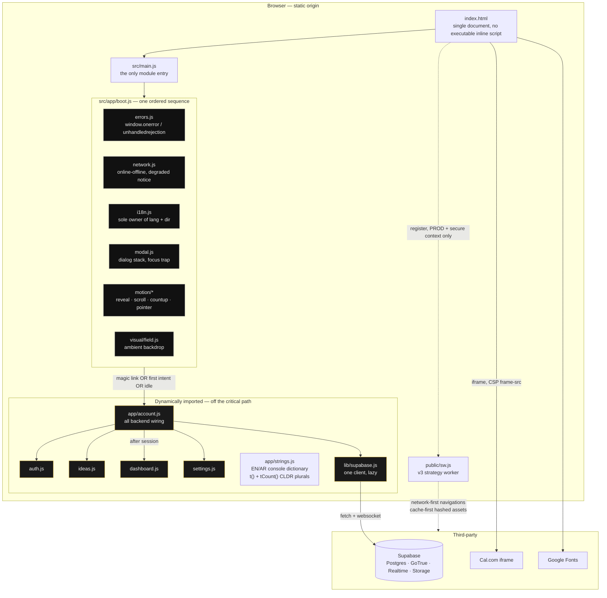
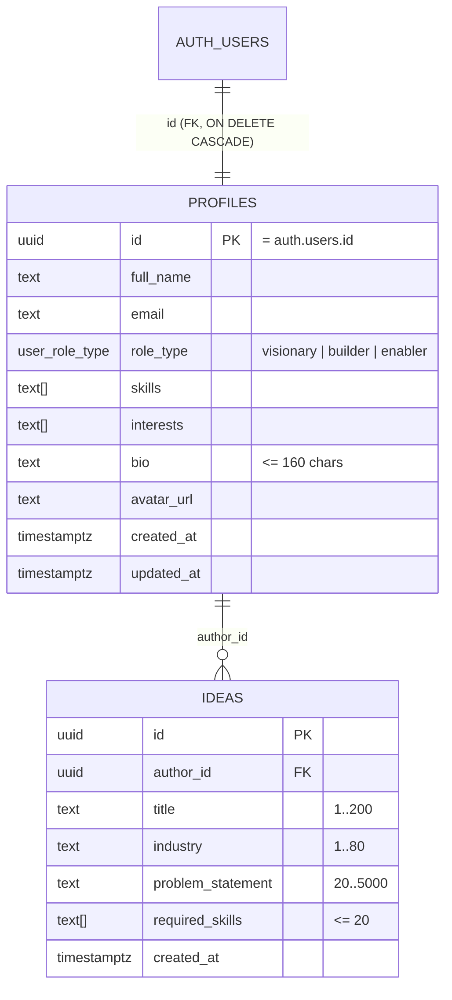
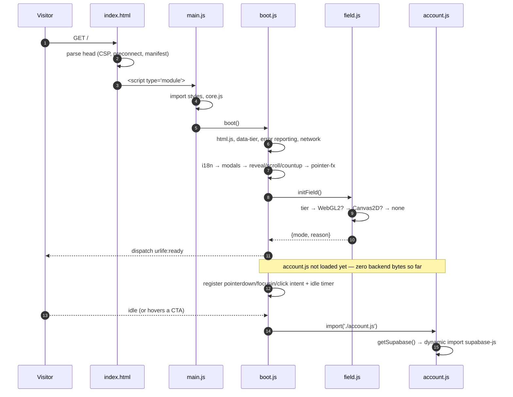
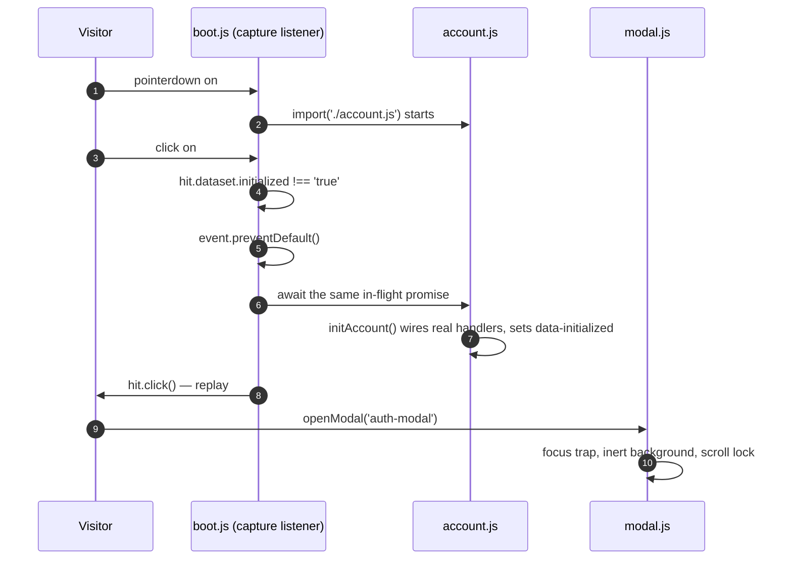
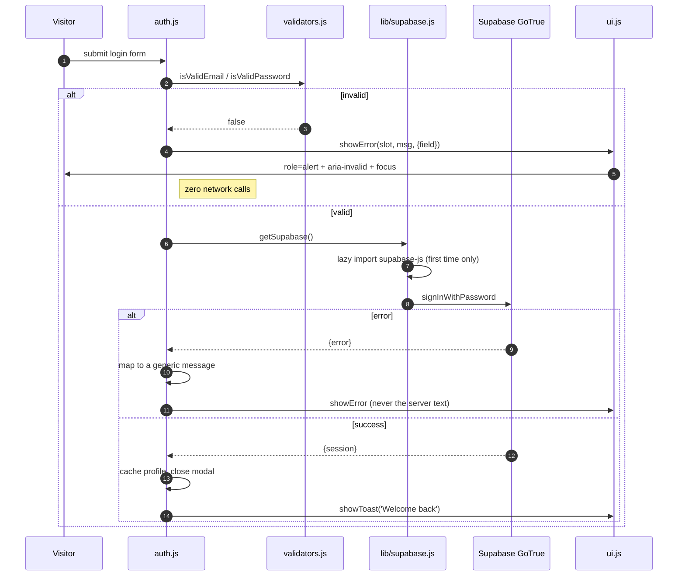
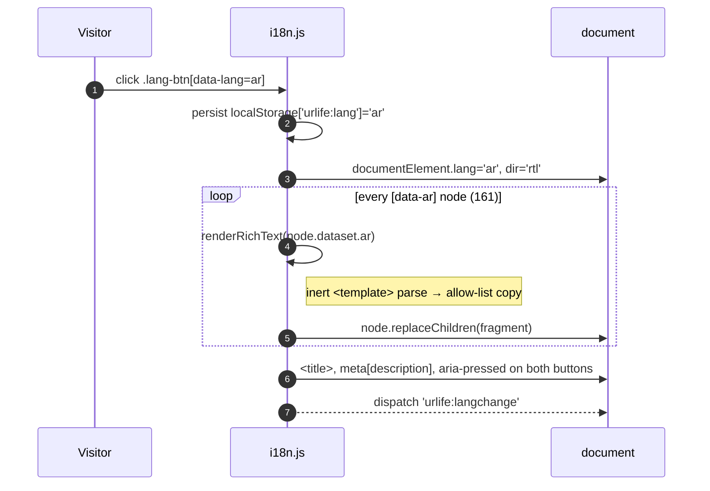
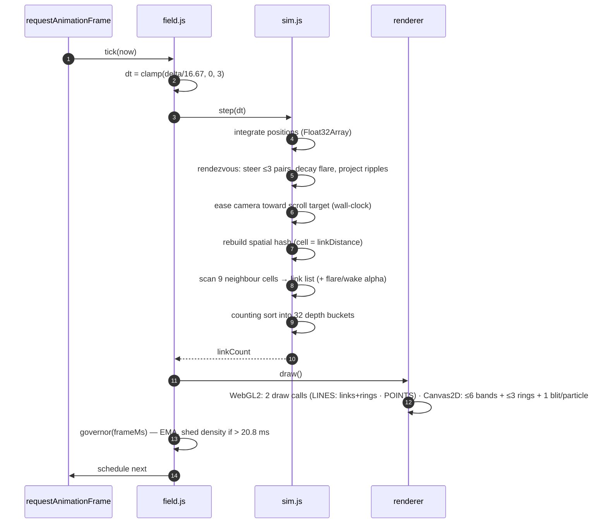

# UrLife — Reconstructed Architecture & Behavioural Specification

This document is written to be sufficient to rebuild the artifact from scratch.
It describes what the system **is**, not what it aspires to be. Every claim is
either directly verifiable in the repository or marked with a confidence level.

---

## 1. One-line classification

A single-page, zero-framework marketing site for an Arab-world startup studio
("the YCombinator for the Arab world"), with an embedded, progressively-loaded
member console (auth, idea submission, explainable deterministic-match dashboard, account settings)
backed entirely by Supabase from the browser.

## 2. Definition of success

The site succeeds when a first-time visitor — on a mid-range phone, on a slow
connection, in Arabic or English — reaches a rendered, readable, interactive
hero in under two seconds, understands the three roles (Visionary, Builder,
Enabler) and the closed-meeting process without scrolling past a wall of text,
and can either book a meeting or submit an idea without the page ever telling
them something has gone wrong. Everything else — the particle field, the
custom cursor, the tilt — exists only to make that path feel considered. If a
visual effect costs the first paint, it has failed its purpose.

## 3. Stack fingerprint

| Layer        | Technology                                                        | Confidence                                                                                                |
| ------------ | ----------------------------------------------------------------- | --------------------------------------------------------------------------------------------------------- |
| Build        | Vite 6, `appType: 'mpa'`, single HTML input                       | CONFIRMED (`vite.config.js`)                                                                              |
| Language     | ES2022 modules, no TypeScript in the app graph                    | CONFIRMED                                                                                                 |
| UI           | Hand-written DOM, zero UI framework                               | CONFIRMED                                                                                                 |
| Styling      | Plain CSS, custom properties, no preprocessor, no Tailwind build  | CONFIRMED (Tailwind utility class _names_ appear in markup but no Tailwind is installed — they are inert) |
| Backend      | Supabase (Postgres + GoTrue + Realtime + Storage), browser-direct | CONFIRMED                                                                                                 |
| Auth         | Email+password and magic link, PKCE, `storageKey: 'urlife-auth'`  | CONFIRMED                                                                                                 |
| Scheduling   | Cal.com iframe embed                                              | CONFIRMED                                                                                                 |
| Native shell | Capacitor 7 (`android/`, `ios/`, `capacitor.config.ts`)           | CONFIRMED, not exercised in this pass                                                                     |
| Hosting      | Static; any CDN. No server-side code of any kind                  | CONFIRMED                                                                                                 |
| 3D / WebGL   | Dependency-free WebGL2, written in-repo                           | CONFIRMED (`src/visual/renderer-webgl.js`)                                                                |

**Removed during this upgrade, with evidence:** `react`, `react-dom`,
`@react-three/fiber`, `@react-three/drei`, `three`, `gsap`, `lenis`. None of
them were imported by any module reachable from the entry point. A contract
test (`tests/contracts/document.test.js` → _dependency hygiene_) now fails the
build if any runtime dependency is declared but never imported.

## 4. Visual-layer decision

**Warranted — yes.** The product sells taste and exclusivity to founders and
capital; an inert flat page undercuts the pitch, and the original already
committed to a dark luxe aesthetic with gold accents.
**But it must cost nothing on the critical path**, so the effect is implemented
as a dependency-free WebGL2/Canvas2D constellation field with a pure-CSS static
fallback and a hardware-tier budget — not by reviving a 600 kB 3D stack. Since
the 2026-10 upgrade the field is also _narrative_: it is depth-graded, it
wakes around the pointer, it dollies with scroll, and it stages rendezvous
events — the brand promise performed by the backdrop itself.

---

## 5. System architecture

### Module ownership rules

These are the invariants that keep the system from regressing to its previous
state. Each is enforced by a test, a lint rule, or a build plugin.

| Rule                                                | Enforced by                                                                                            |
| --------------------------------------------------- | ------------------------------------------------------------------------------------------------------ |
| Exactly one module entry point                      | `tests/contracts/document.test.js`                                                                     |
| No executable inline `<script>`                     | contract test + CSP without `unsafe-inline`                                                            |
| No inline `<style>` over 2 kB                       | `noInlineStyleBlocks` plugin in `vite.config.js` (fails the build)                                     |
| Exactly one Supabase client                         | `src/lib/supabase.js` global-keyed singleton; ESLint bans importing `supabaseClient*`                  |
| Exactly one owner of `lang`/`dir`                   | `src/app/i18n.js`; flow test asserts both change together                                              |
| No element is observed by two IntersectionObservers | boot flow test maps every observed node to its watchers                                                |
| `console.*` only inside the logger                  | ESLint `no-console` with a single-file exemption                                                       |
| No non-literal `innerHTML`                          | ESLint `no-restricted-syntax` (one documented exemption: the sanitiser's own inert `<template>` parse) |
| Nothing imports `archive/`                          | ESLint `no-restricted-imports`                                                                         |
| Gzipped HTML ≤ 24 kB, total ≤ 170 kB                | `sizeBudget` plugin in `vite.config.js` (fails the build)                                              |

---

## 6. Data model

Source of truth: `nexus-schema.sql`.

- `user_role_type` is a Postgres enum with exactly three values. `src/validators.js`
  exports `ROLE_TYPES` as the single client-side mirror of that enum, and a unit
  test asserts nothing else is accepted.
- Re-counted against the committed file: **3 tables** (`profiles`, `ideas`,
  `idea_interests`), **3 enums**, **4 views**, **17 indexes** (including GIN and
  trigram indexes supporting skill and name search), **11 policies** and
  **8 triggers**.
- Row-level security is `ENABLE`d **and** `FORCE`d on all three tables — an
  earlier revision of this document claimed the `ideas` policies were absent
  from the repository. They are present (`ideas_select_public`,
  `ideas_select_own`, `ideas_insert_own`, `ideas_update_own`).
- The client now speaks this schema directly. `src/ideas.js` writes
  `author_id` and `problem_statement`; `src/dashboard.js` reads `ideas_public`,
  `profiles_public` and `idea_interests`; and match scores are computed
  client-side by `src/matchingEngine.js` rather than depending on absent
  `matches` / `v_top_matches` prototype relations.
- Sign-up metadata is normalised on both sides: the browser sends schema-native
  `role_type` plus legacy `role`, and `handle_new_user()` accepts either CSV or
  JSON-array skills before inserting a full `profiles` row with `username`.

---

## 7. Behavioural specification

Every statement below is a testable assertion. The parenthesised reference is
the spec that enforces it.

### 7.1 First paint and boot

1. The document loads exactly one module (`/src/main.js`) and no executable inline script.
   (`contracts/document.test.js`)
2. `boot()` runs its steps in a fixed order; each step is wrapped so a thrown
   error disables only that subsystem. (`flows/boot-and-motion.test.js`)
3. `boot()` is idempotent — a second call is refused and returns the first
   result rather than doubling document listeners.
4. On completion it sets `html.dataset.tier`, swaps `no-js` → `js`, and
   dispatches `urlife:ready` exactly once with `{ bootMs, tier, field, revealCount }`.
5. `?debug=1` mounts a live stats overlay; it is never present otherwise.

### 7.2 Language

6. Every translatable node carries both `data-en` and `data-ar`; there are
   > 100 of them.
7. Clicking **AR** replaces the text of all of them, sets `lang="ar"`,
   `dir="rtl"`, swaps `<title>` and `meta[name=description]`, and flips
   `aria-pressed` on both buttons. Clicking **EN** reverses all of it.
   (`flows/i18n.test.js`)
8. The choice persists in `localStorage['urlife:lang']` and survives reload.
   `?lang=` overrides the stored value.
9. Translations may contain only `<strong> <em> <b> <i>   ` with a
   `class` drawn from a small allow-list. Anything else is unwrapped to text.
   `<script>`, `` and every `on*` attribute are dropped.

### 7.3 Dialogs

10. Opening a dialog moves focus into it, marks `.page-wrap` `inert`, locks body
    scroll, and sets `aria-hidden="false"`.
11. Tab and Shift+Tab cycle within the dialog and never escape it.
12. Escape closes only the topmost dialog. Clicking the backdrop closes; clicking
    the card does not.
13. Closing restores focus to the element that opened the dialog and unlocks
    scroll only when the last dialog closes. (`flows/modal.test.js`)
14. The accepted-interest terms workspace is registered with this same modal
    controller. It validates proposed percentages and a milestone, but is
    explicitly an in-browser discussion draft: it does not sign an agreement,
    save terms, transfer money or create escrow. (`flows/deal-room.test.js`)

### 7.4 Authentication

14. Email format and password policy (≥8 chars, ≥1 digit, ≥1 letter) are checked
    **before** any network call. A failure populates a `role="alert"` slot, sets
    `aria-invalid` on the field, links them with `aria-describedby`, and focuses
    the field.
15. Supabase error text is never shown verbatim; `Invalid login credentials: user 4b21 not found`
    surfaces as _"Incorrect email or password."_ (`flows/auth-and-ideas.test.js`)
16. Registration rejects any `role_type` outside the enum.
17. A magic-link callback (`#access_token`, `?code=`, `?token_hash=`,
    `?type=magiclink`) loads the account module **eagerly**, because the token
    must be consumed before it expires.

### 7.5 Idea submission

18. Title 5–200, industry 2–80, problem ≥20 chars, skills capped at 20 entries,
    all validated client-side with field-level error reporting.
19. A non-Visionary is not silently rejected: the draft is written to
    `sessionStorage['nexus_pending_idea']` and a toast offers _"Switch to Visionary"_.
20. On success the idea is inserted and rendered into `#ideas-feed-list`, with
    every field written through `textContent` — never parsed as markup.

### 7.6 Motion and the ambient field

21. One `IntersectionObserver` drives all reveals — no element is ever watched
    by two of them — and each element is unobserved after it fires once.
22. Under `prefers-reduced-motion`, everything is revealed immediately and no
    continuous loop starts. If the OS preference changes while the page is open,
    the field stops immediately, hides its canvas and yields to the static
    fallback; it resumes only if the user later re-allows motion.
23. Scroll writes a single custom property `--scroll-progress` and mirrors it to
    `aria-valuenow` on the progressbar, from one passive scroll listener.
24. Pointer effects write only CSS custom properties, read geometry at most once
    per frame per element, and are disabled for coarse pointers, reduced motion,
    and low hardware tiers.
25. The field selects WebGL2 → Canvas2D → nothing. When it refuses to run it
    hides the canvas so the pure-CSS gradient is the only backdrop.
26. The field pauses when the tab is hidden and when the canvas scrolls out of
    view, and removes every listener it added on `destroy()`.
27. An EMA frame-time governor sheds up to three density steps (×0.7, floor 24
    particles) if the measured frame cost exceeds 125 % of the 60 fps budget.
28. On every tier that runs, the field stages the brand story: a _rendezvous_
    every 4–8 s (≤ 3 concurrent on high, ≤ 2 on mid) — two particles ease
    together, contact ignites an ember-gold flare, and a ripple ring expands
    from the meeting point. State is bounded typed arrays; the scheduler is
    seeded, so runs stay reproducible.
29. The camera pans in world space as the reader scrolls (±130 px, eased on
    wall-clock delta), so near layers travel further than far ones — real
    differential parallax for zero extra draw calls.
30. A rendezvous whose particles are shed by the governor is dropped, never
    steered; meetings never reference indices ≥ the live particle count.

### 7.7 Degraded mode

28. With no Supabase credentials the site still renders, scrolls and animates.
    `getSupabaseSync()` returns a chainable stub; reads resolve empty, writes
    resolve `{ error: BackendUnavailableError }`. The stub is never memoised into
    the real singleton slot, so a later real client can still be installed.
29. In development a banner names the missing variables. In production the same
    condition is logged, never rendered — a misconfigured deploy must not leak
    its configuration surface.

### 7.8 Offline

30. The service worker is network-first with a 4 s timeout for navigations
    (falling back to cache, then to an inline offline document), cache-first for
    hashed `/assets/*`, and stale-while-revalidate for other static files. It
    ignores non-GET, cross-origin, range and Supabase (`/rest/`, `/auth/`)
    requests, prunes old caches on activate, and caps the asset cache at 120
    entries.

---

## 8. Sequence diagrams

### 8.1 First load, no session

### 8.2 CTA click before the account module has finished loading

This is the race the capture-phase click replay exists to solve.

### 8.3 Sign-in

### 8.4 Language switch

### 8.5 Ambient field frame

---

## 9. Evidence table

| #   | Claim                                          | Confidence | Evidence                                                                                                                                           |
| --- | ---------------------------------------------- | ---------- | -------------------------------------------------------------------------------------------------------------------------------------------------- |
| 1   | Zero UI framework reaches the browser          | CONFIDENT  | `package.json` dependencies = 2; dependency-hygiene contract test                                                                                  |
| 2   | Supabase is off the critical path              | CONFIDENT  | `measure-bundle` — `vendor-supabase` is not referenced by `index.html`                                                                             |
| 3   | One Supabase client at runtime                 | CONFIDENT  | single global key; duplicate `supabaseClient.ts` deleted; ESLint ban                                                                               |
| 4   | Translations cover the whole page              | CONFIDENT  | 161 nodes mutated per switch, asserted                                                                                                             |
| 5   | Dialogs are keyboard-complete                  | CONFIDENT  | 15 modal specs + axe pass inside each dialog                                                                                                       |
| 6   | Field falls back correctly without WebGL       | CONFIDENT  | the test environment returns `null` for WebGL, so the fallback chain is genuinely exercised                                                        |
| 7   | Grid neighbour search ≡ brute force            | CONFIDENT  | `unit/sim.test.js` compares pair-for-pair across 3 densities × 25 frames — still true with the rendezvous layer active (`unit/rendezvous.test.js`) |
| 8   | Critical path −58.1 % gzip                     | CONFIDENT  | `npm run measure:baseline` against the committed pre-upgrade build                                                                                 |
| 9   | Simulation 3.1× cheaper at equal parameters    | CONFIDENT  | `npm run bench`, min-to-min of 9×600 frames (2026-10 re-measurement on this runner)                                                                |
| 10  | Zero axe violations in 5 page states           | CONFIDENT  | `tests/a11y/axe.test.js`                                                                                                                           |
| 10a | Rendezvous meetings converge, flare and ripple | CONFIDENT  | `unit/rendezvous.test.js` — spawn/contact distance, flare peak + decay, ripple growth/expiry, determinism                                          |
| 10b | The story layer costs ~0 CPU                   | CONFIDENT  | `npm run bench` rendezvous row: meetings at max cadence measure within run noise of a plain field                                                  |
| 10c | WebGL path obeys its budget                    | CONFIDENT  | `unit/renderer-webgl.test.js` mock-GL contract: exactly 2 draw calls incl. rings, 5×24-byte attribute layout, additive blend, create/delete parity |
| 10d | Canvas2D path obeys its budget                 | CONFIDENT  | `unit/renderer-2d.test.js` recording context: ≤ 6 band strokes + ≤ 3 ring strokes, ember blit only while flaring                                   |
| 10e | GL shaders compile on real drivers             | UNKNOWN    | sources are structurally validated (ES 3.00, stage-matched) but no GPU/browser was reachable here — see `docs/VERIFICATION.md` §Limits             |
| 11  | RLS protects `profiles`                        | PROBABLE   | `nexus-schema.sql` enables and forces RLS; policy bodies not executed here                                                                         |
| 12  | `ideas` has equivalent RLS                     | UNKNOWN    | not present in the repository — see §6                                                                                                             |
| 13  | Real-device FPS of the field                   | UNKNOWN    | no browser available in this environment — see `docs/VERIFICATION.md` §Limits                                                                      |
| 14  | Capacitor shells still build                   | UNKNOWN    | requires Xcode/Android SDK; unchanged by this work                                                                                                 |

## 10. Unknowns and the cheapest way to resolve each

| Unknown                                 | Cheapest resolution                                                                                         |
| --------------------------------------- | ----------------------------------------------------------------------------------------------------------- |
| `ideas` RLS policies                    | `select * from pg_policies where tablename='ideas'` in the Supabase SQL editor (30 s)                       |
| Real-browser FPS, LCP, CLS              | `npx lighthouse http://localhost:4173 --preset=desktop` after `npm run preview`, on any machine with Chrome |
| Whether the Cal.com link is current     | One HTTP HEAD on `VITE_CAL_LINK`                                                                            |
| Whether the native shells still compile | `npm run cap:sync && npx cap open ios` on a Mac with Xcode                                                  |
| Production CSP violations               | Deploy with `Content-Security-Policy-Report-Only` and a report endpoint for 24 h                            |
